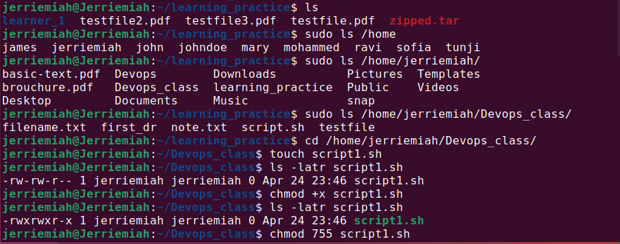
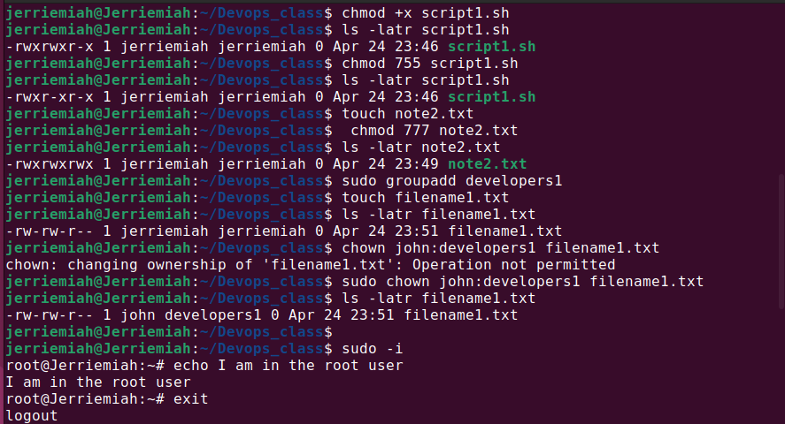
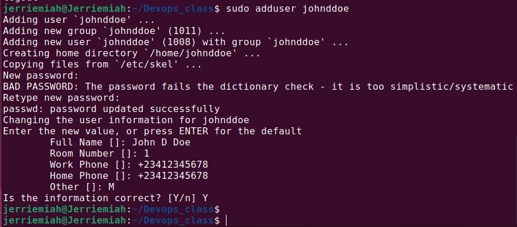
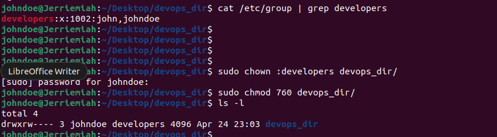
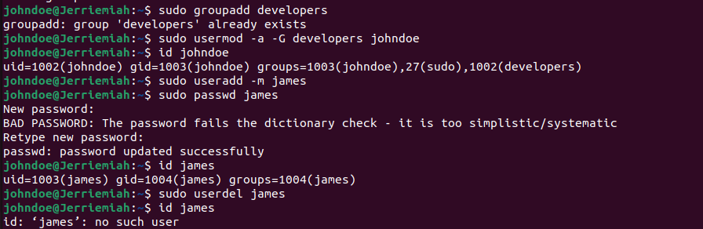
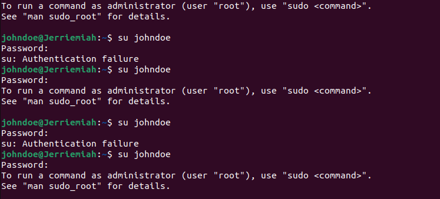
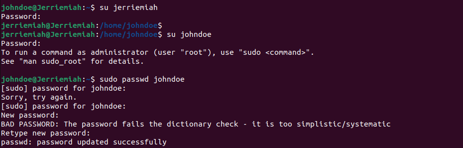
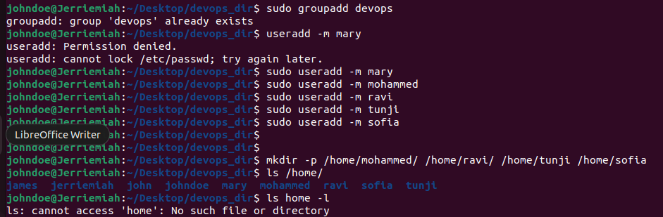
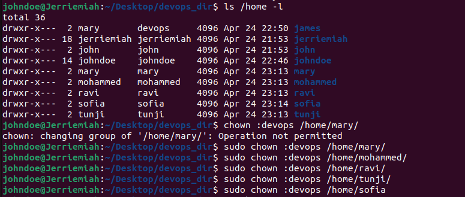
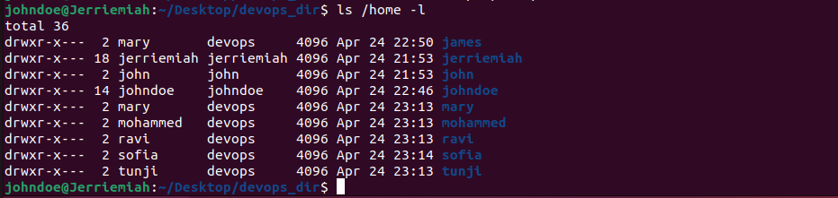

# advance_linux_commands

### **File Permissions and Access Rights Explained**
Linux file permissions determine who can read, write, or execute a file. They follow a structured format using symbolic and numeric representations.

- Symbolic Representation (ls -l Output)
  ```bash
  ls -l script.sh

- Produces:
  ```
  -rwxr-xr-x 1 user user 1234 Apr 25 00:42 script.sh
  rwxr-xr-x → 
  
File permissions are divided into:

- Owner (user): rwx (read, write, execute)

- Group: r-x (read, execute)

- Others: r-x (read, execute)

### Numeric Representation
Each permission has a numeric value:

- r (read) = 4

- w (write) = 2

- x (execute) = 1

- No permission = 0

### To set permissions using numbers:
 -
   ```bash
   chmod 755 script.sh

Breakdown:

- 7 (Owner: rwx → 4+2+1)

- 5 (Group: r-x → 4+0+1)

- 5 (Others: r-x → 4+0+1)

- For full access:
  ```bash
  chmod 777 note.txt
Where:

- 7 (Owner: rwx)

- 7 (Group: rwx)

- 7 (Others: rwx)

Proper permission management ensures security, preventing unauthorized access or unintended modifications.


### 1. File Permissions (chmod)
- Commands practiced:

  ```bash
  touch script.sh
  ls -l script.sh
  chmod +x script.sh
  ls -l script.sh
  chmod 755 script.sh
  touch note.txt
  chmod 777 note.txt
  ls -latr note.txt
  
### What was learned:

- Checked file permissions.

- Made a script executable.

- Used both symbolic and numeric permission modifications.

##

### 2. Changing File Ownership (chown)
- Commands practiced:

  ```bash
  sudo useradd john
  sudo groupadd developers
  touch filename.txt
  sudo chown john:developers filename.txt

### What was learned:

- Created a new user (john).

- Created a new group (developers).

- Changed ownership of a file to a specific user and group.

##

### 4. User Management
- Commands practiced:

  ```bash
  sudo useradd johnddoe
  sudo usermod -aG sudo johnddoe
  cd /home/johnddoe
  su johndoe
  passwd johndoe
  sudo groupadd developers
  sudo usermod -aG developers johndoe
  id johndoe
  sudo userdel johndoe

### What was learned:

- Created a new user (johnddoe).

- Granted sudo privileges.

- Navigated to the user's home directory.

- Changed the user password.

- Added the user to a group.

- Verified group membership.

- Deleted the user.

##

### 5. Group Permissions
- Commands practiced:

  ```bash
  sudo chown :developers /developers

### What was learned:

- Changed group ownership of a directory.

- Ensured proper permissions for group access.

##

### 6. Side Hustle Task 3
- Commands practiced:

  ```bash
  sudo groupadd devops
  sudo useradd mary
  sudo useradd mohammed
  sudo useradd ravi
  sudo useradd tunji
  sudo useradd sofia
  sudo usermod -aG devops mary
  sudo usermod -aG devops mohammed
  sudo usermod -aG devops ravi
  sudo usermod -aG devops tunji
  sudo usermod -aG devops sofia
  mkdir /home/mary
  mkdir /home/mohammed
  mkdir /home/ravi
  mkdir /home/tunji
  mkdir /home/sofia
  sudo chown :devops /home/mary
  sudo chown :devops /home/mohammed
  sudo chown :devops /home/ravi
  sudo chown :devops /home/tunji
  sudo chown :devops /home/sofia

### What was learned:

- Created a new group (devops).

- Created multiple users.

- Added users to the devops group.

- Created home directories for each user.

- Ensured that directories belong to the correct group.


##

### **Proof of Practice**
Screenshots of all executed commands will be provided below as proof


#

#

#

#

#

#

#

#

#
